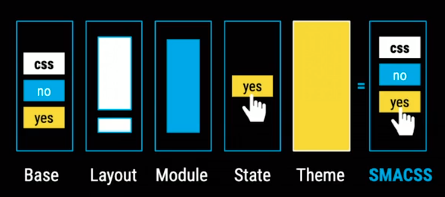

# Arquitecturas en CSS

## OOCSS

Object Oriented CSS: Separa el diseno del contenido, asi podemos reutilizar el codigo.

## BEM

Block Elemento Modifier: Separa los bloques, elementos y los elementos modificadores.

## SMACSS

Arquitectura de CSS escalable y modular.

## ITCSS

Triangulo Invertido de CS, lo dividimos en Ajustes, Herraminetas, Genericos, Elementos, Objetos, Componentes y Utilidades.

## ATOMIC DESIGN

Se baso en quimica, para esta arquitectura.
